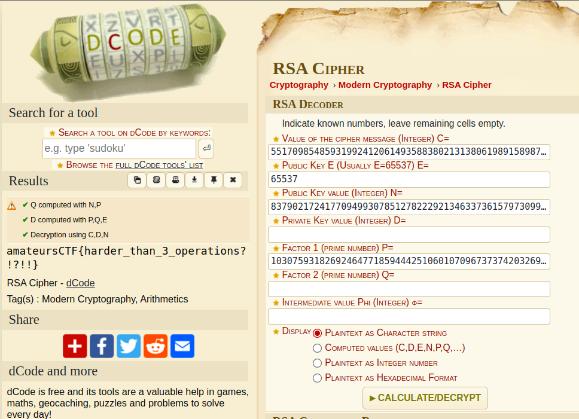

# You get extra information 1
We are given following code and output from it.
```python
from Crypto.Util.number import *
from flag import flag

p = getPrime(512)
q = getPrime(512)
n = p*q
p = p + q
e = 0x10001

extra_information = p + q
ptxt = bytes_to_long(flag)
c = pow(ptxt, e, n)

with open('output.txt', 'w') as f:
    f.write(f"n: {n}\nc: {c}\ne: {e}\nextra_information: {extra_information}")
```

```
n: 83790217241770949930785127822292134633736157973099853931383028198485119939022553589863171712515159590920355561620948287649289302675837892832944404211978967792836179441682795846147312001618564075776280810972021418434978269714364099297666710830717154344277019791039237445921454207967552782769647647208575607201
c: 55170985485931992412061493588380213138061989158987480264288581679930785576529127257790549531229734149688212171710561151529495719876972293968746590202214939126736042529012383384602168155329599794302309463019364103314820346709676184132071708770466649702573831970710420398772142142828226424536566463017178086577
e: 65537
extra_information: 26565552874478429895594150715835574472819014534271940714512961970223616824812349678207505829777946867252164956116701692701674023296773659395833735044077013
```

## Solution
This is very easy to break RSA because we are provided with `extra_value` $x = p+2*q$ as we can see in python script above and therefore:
$n = pq$<br>
$x = p+2q$<br>
$q = \frac{x-p}2$<br>
$2n = p(x-p)$<br>
$p^2-xp+2n=0$<br>
Now we can solve this quadratic equation for $p$
```python
import sympy as sp  
n = '83790217241770949930785127822292134633736157973099853931383028198485119939022553589863171712515159590920355561620948287649289302675837892832944404211978967792836179441682795846147312001618564075776280810972021418434978269714364099297666710830717154344277019791039237445921454207967552782769647647208575607201'

x = '26565552874478429895594150715835574472819014534271940714512961970223616824812349678207505829777946867252164956116701692701674023296773659395833735044077013'

y = f'p ** 2 - {x} * p + 2 * {n}' 

s = sp.var('p')
print(sp.solve(y,p))
```

and use some tool like [this](https://www.dcode.fr/rsa-cipher) to decipher `c`.<br>

